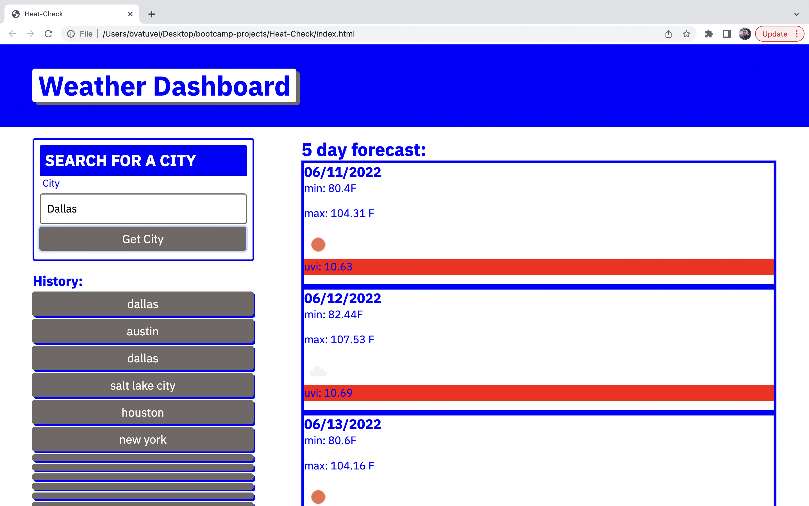

# Heat-Check/Weather Dashboard

# My motivation behind this project was to make a weather dashboard that allowed the user to search for a city and see the current weather along with the weather for the next five days along with the uvi index.

# [Installation] In order to install my program: Step1-create a new directory on local computer. Step2-Go to my GitHub profile @Bvatuvei. Step3-Go to my repositories and select "Heat-Check". Step4-Click on code and then copy ssh or https. Step5- Open terminal and type "git clone <"your previously copied ssh/https">.

# [website-link]https://bvatuvei.github.io/Heat-Check/

## Screenshot
